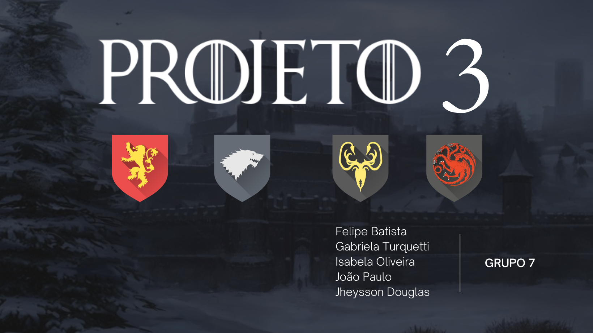
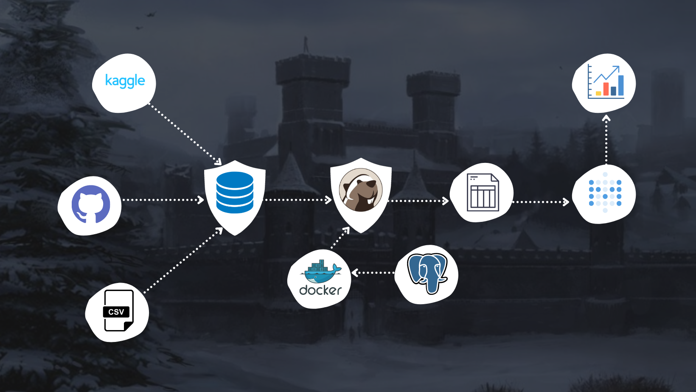

# PROJETO 3 - RESILIA

# O projeto

Projeto de finalização do terceiro módulo da turma VamoAI. A turma VamoAI é uma parceria da [Resilia Educação](https://www.resilia.work/sobre) com o Ifood para formação de novos analistas de dados.

Ao fim de cada módulo produzimos, em grupos, um projeto para finalização de mais uma etapa em nossa jornada e neste módulo analisamos o banco de dados da aclamada série Game Of Thrones da HBO. 

Utilizando o sistema gerenciador de banco de dados PostgreSQL, aliada a ferramenta de elaboração de insights Metabase, buscamos entender mais sobre o universo fantástico de Westeros, sobre a visão da audiência e da crítica, sobre dados da produção da série e, também, como espectadores, buscamos responder curiosidades nossas.

Os bancos de dados utilizados por nós estão disponíveis aqui no repositório na pasta Database. Esses bancos foram retirados do site do [Kaggle](https://www.kaggle.com/rezaghari/game-of-thrones) e, também, do repositório do GitHub do [Jeffrey Lancaster](https://github.com/jeffreylancaster/game-of-thrones).

# Integrantes

<table width = 550px  align='center'>
<tr>
<td><b>Felipe Batista</b> 
<a href="https://www.linkedin.com/in/felisouza/"><image src="./imagens/linkedIN.svg" width="25"/></a><a href = "https://www.linkedin.com/in/felisouza/"> in/felisouza </a>
 
<a href="https://github.com/Felisouza"><image src="./imagens/github-icon.svg" width="25"/></a><a href="https://github.com/Felisouza"> Felisouza</a>

<td><b>Gabriela  Turquetti </b>
 
<a href="https://www.linkedin.com/in/gabriela-turquetti/"><image src="./imagens/linkedIN.svg" width="25"/></a><a href = "https://www.linkedin.com/in/gabriela-turquetti/"> in/gabriela-turquetti </a>
 
<a href="https://github.com/turquetti"><image src="./imagens/github-icon.svg" width="25"/></a><a href="https://github.com/turquetti"> turquetti</a>

<td><b>Isabela Oliveira</b>
 
<a href="https://www.linkedin.com/in/isaolivlima/"><image src="./imagens/linkedIN.svg" width="25"/></a><a href = "https://www.linkedin.com/in/isaolivlima/"> /in/isaolivlima </a>
 
<a href="https://github.com/isaolivlima"><image src="./imagens/github-icon.svg" width="25"/></a><a href="https://github.com/isaolivlima"> isaolivlima</a>
</td>
</table>

<table align='center'>
<td><b> Jheysson Douglas</b>
 
<a href="https://www.linkedin.com/in/jheysson-douglas-868342100/"><image src="./imagens/linkedIN.svg" width="25"/></a><a href = "https://www.linkedin.com/in/jheysson-douglas-868342100/"> in/jheysson-douglas</a>
 
<a href="https://github.com/JheyssonDouglas"><image src="./imagens/github-icon.svg" width="25"/></a><a href="https://github.com/JheyssonDouglas"> JheyssonDouglas</a>

<td><b>João Paulo</b>
 
<a href="https://www.linkedin.com/in/joao-paulo-dos-santos-nunes-006061128/"><image src="./imagens/linkedIN.svg" width="25"/></a><a href = "https://www.linkedin.com/in/joao-paulo-dos-santos-nunes-006061128/"> in/joao-paulo-dos-santos-nunes</a>
 
<a href="https://github.com/jpnune"><image src="./imagens/github-icon.svg" width="25"/></a><a href="https://github.com/jpnune"> jpnune</a>
	</table>
	 

# Fluxograma

